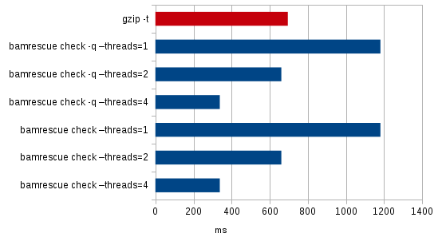
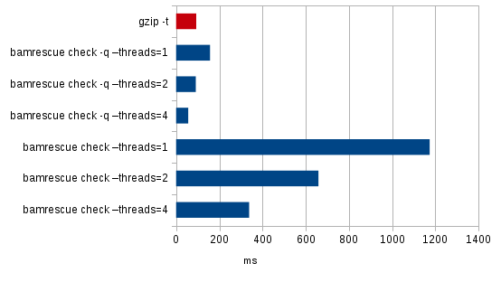

# bamrescue [](https://crates.io/crates/bamrescue) [](https://apt.arkanosis.net/pool/stable/b/bamrescue/bamrescue.deb) [](/LICENSE) [](https://travis-ci.org/Arkanosis/bamrescue)

**bamrescue** is a command line utility to check Binary Sequence
Alignment / Map (BAM) files for corruption and rescue as much data
as possible from them in the event they happen to be corrupted.

[](https://asciinema.org/a/187594)

## Installation

### On Debian and derivatives (Ubuntu, Mint…)

Pre-built packages are provided for Debian and derivatives. They are only
tested with Debian 8 (Jessie), Debian 9 (Stretch), Ubuntu 16.04 LTS (Xenial)
and Ubuntu 18.04 LTS (Bionic).

```bash
# Install prerequisites
sudo apt install curl apt-transport-https

# Add the author's PGP key
curl -s https://arkanosis.net/jroquet.pub.asc | sudo apt-key add -

# Add the author's apt stable channel to your apt sources
echo "deb https://apt.arkanosis.net/ software stable" | sudo tee /etc/apt/sources.list.d/arkanosis.list

# Update and install bamrescue
sudo apt update
sudo apt install bamrescue
```

## Usage

```
Usage: bamrescue check [--quiet] [--threads=<threads>] <bamfile>
       bamrescue rescue [--threads=<threads>] <bamfile> <output>
       bamrescue -h | --help
       bamrescue --version

Commands:
    check                Check BAM file for corruption.
    rescue               Keep only non-corrupted blocks of BAM file.

Arguments:
    bamfile              BAM file to check or rescue.
    output               Rescued BAM file.

Options:
    -h, --help           Show this screen.
    -q, --quiet          Do not output statistics, stop at first error.
    --threads=<threads>  Number of threads to use, 0 for auto [default: 0].
    --version            Show version.
```

## How it works

A BAM file is a BGZF file ([specification](https://samtools.github.io/hts-specs/SAMv1.pdf)),
and as such is composed of a series of concatenated RFC1592-compliant gzip
blocks ([specification](https://tools.ietf.org/html/rfc1952)).

Each gzip block contains at most 64 KiB of data, including a CRC32 checksum of
the uncompressed data which is used to check its integrity.

Additionally, since gzip blocks start with a gzip identifier (ie. 0x1f8b), a
fixed gzip method (ie. 0x8) and fixed gzip flags (ie. 0x4), and bgzf blocks
include both a bgzf identifier (ie. 0x4243), a fixed extra subfield length
(ie. 0x2) and their own compressed size, it is possible to skip over corrupted
blocks (at most 64 KiB) to the next non-corrupted block with limited complexity
and acceptable reliability.

This property is used to rescue data from corrupted BAM files by keeping only
their non-corrupted blocks, hopefully rescuing most reads.

## Example

A bam file of 40 MiB (which is very small by today standards) has been
corrupted by two hard drive bad sectors. Most tools (including gzip) choke on
the file at the first corrupted byte, meaning that up to 100% of the bam
payload is considered lost depending on the tool.

Let's check the file using bamrescue:

```shell
$ bamrescue check samples/corrupted_payload.bam
bam file statistics:
   1870 bgzf blocks checked (117 MiB of bam payload)
      2 corrupted blocks found (0% of total)
     46 KiB of bam payload lost (0% of total)
```

Indeed, a whole hard drive bad sector typically amounts for 512 bytes lost,
which is much smaller than an average bgzf block (which can be up to 64 KiB
large).

Even though most tools would gave up on this file, it still contains almost
100% of non-corrupted bam payload, and the user probably wouldn't mind much if
they could work only on that close-to-100% amount of data.

Let's rescue the non-corrupted payload (beware: this takes as much additional
space on the disk as the original file):

```shell
$ bamrescue rescue samples/corrupted_payload.bam rescued_file.bam
bam file statistics:
   1870 bgzf blocks found (117 MiB of bam payload)
      2 corrupted blocks removed (0% of total)
     46 KiB of bam payload lost (0% of total)
   1868 non-corrupted blocks rescued (100% of total)
    111 MiB of bam payload rescued (100% of total)
```

The resulting bam file can now be used like if it never had been corrupted.
Rescued data is validated using a CRC32 checksum, so it's not like ignoring
errors and working on corrupted data (typical use of gzip to get garbage data
from a corrupted bam file): it's working on (ridiculously) less, validated
data.

## Performance

bamrescue is very fast. Actually, it is even faster than gzip while doing more.

Here are some numbers for a [40 MiB, non-corrupted bam file](http://hgdownload.cse.ucsc.edu/goldenPath/hg19/encodeDCC/wgEncodeUwRepliSeq/wgEncodeUwRepliSeqK562G1AlnRep1.bam):

| Command | Time | Corruption detected |
| :------ | ---: | ------------------: |
| gzip -t  | 695 ms | No |
| bamrescue check -q --threads=1 | 1181 ms | No |
| bamrescue check -q --threads=2 | 661 ms | No |
| bamrescue check -q --threads=4 | 338 ms | No |
| bamrescue check --threads=1 | 1181 ms | No |
| bamrescue check --threads=2 | 661 ms | No |
| bamrescue check --threads=4 | 338 ms | No |



Here are some numbers for the same 40 MiB bam file, with two single-byte
corruptions (at ~7 MiB and ~18 MiB, respectively):

| Command | Time | Corruption detected | Number of corrupted blocks reported | Amount of data rescuable¹ |
| :------ | ---: | ------------------: | ----------------------------------: | ------------------------: |
| gzip -t  | 93 ms | Yes | N/A | 21 Mio (18%) |
| bamrescue check -q --threads=1 | 157 ms | Yes | N/A | 21 Mio (18%) |
| bamrescue check -q --threads=2 | 91 ms | Yes | N/A | 21 Mio (18%) |
| bamrescue check -q --threads=4 | 56 ms | Yes | N/A | 21 Mio (18%) |
| bamrescue check --threads=1 | 1174 ms | Yes | 2 | 117 Mio (99.99%) |
| bamrescue check --threads=2 | 659 ms | Yes | 2 | 117 Mio (99.99%) |
| bamrescue check --threads=4 | 338 ms | Yes | 2 | 117 Mio (99.99%) |

¹ uncompressed bam payload, rescued using `gzip -d` or `bamrescue rescue`



Note: these benchmarks have been run on an Intel Core i5-6500 CPU running
Kubuntu 16.04.2 and rustc 1.18.0.

## Caveats

bamrescue does not check whether the bam payload of the file is actually
compliant with the bam specification. It only checks if it has not been
corrupted after creation, using the error detection codes built in the gzip
and bgzf formats. This means that as long as the tool used to create a bam
file was compliant with the specification, the output of bamrescue will be as
well, but bamrescue itself will do nothing to validate that compliance.

## Compiling

Run `cargo build --release` in your working copy.

## Contributing and reporting bugs

Contributions are welcome through [GitHub pull requests](https://github.com/Arkanosis/bamrescue/pulls).

Please report bugs and feature requests on [GitHub issues](https://github.com/Arkanosis/bamrescue/issues).

## License

bamrescue is copyright (C) 2017-2018 Jérémie Roquet <jroquet@arkanosis.net> and
licensed under the ISC license.
